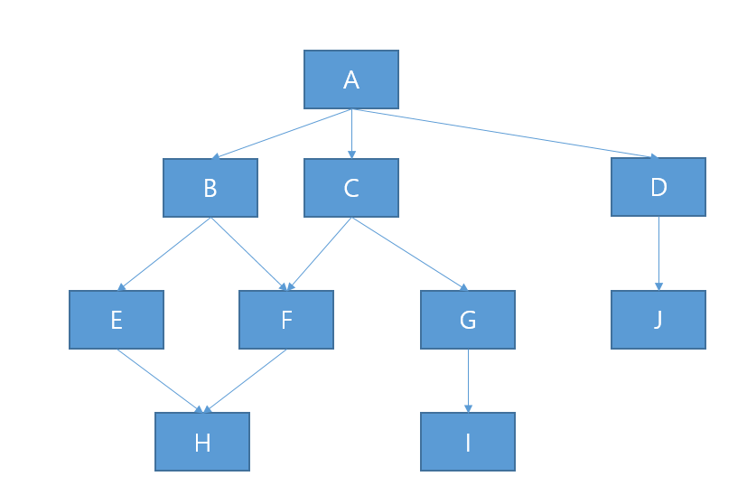

# 문제 20

## 문제

모듈 관계도에서 Fan-in이 2 이상인 모듈 이름을 쓰시오.

<strong>정답 보기</strong>

F, H

<strong>상세 해설</strong>

## 핵심 개념

Fan-in은 해당 모듈을 직접 호출하거나 의존하는 상위 모듈 수다.

## 풀이

그림에서 입력 방향 화살표가 두 개 이상 들어오는 모듈은 F와 H다.

## 오답 분석

Fan-out은 반대로 해당 모듈이 직접 호출하는 하위 모듈 수다.

## 암기 포인트

들어오는 선을 세어 F와 H.

---
