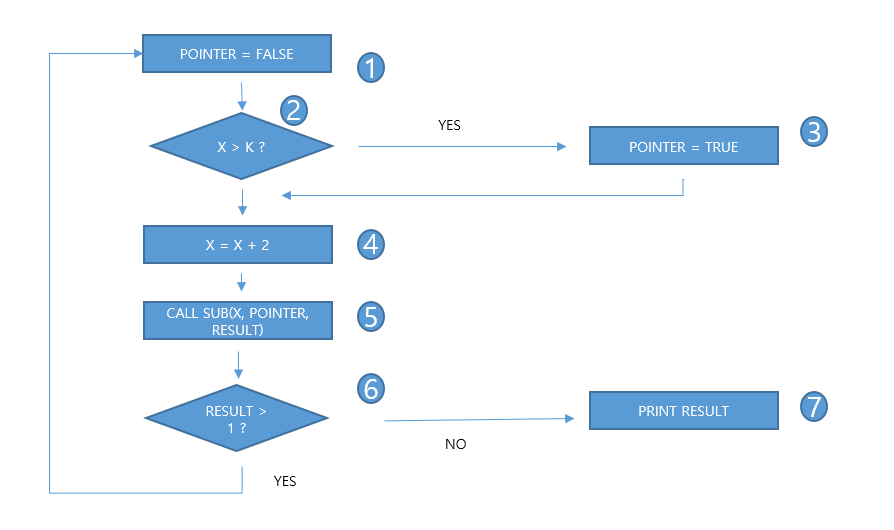

# 문제 07 — 분기 커버리지

## 문제

제어 흐름 그래프의 두 분기 각각에서 참과 거짓 결과를 한 번 이상 실행하는 경로 조합을 쓰시오.

<strong>정답 보기</strong>

1234561과 124567 또는 1234567과 124561

<strong>상세 해설</strong>

## 핵심 개념

분기 커버리지는 각 결정의 참·거짓 결과를 모두 실행하는지 확인한다.

## 풀이

첫 분기와 두 번째 분기의 참·거짓 조합을 모두 포함하는 두 경로를 원문 그래프에서 선택한다. 제시 가능한 순서는 1234561,124567 또는 1234567,124561이다.

## 오답 분석

모든 문장을 한 번 실행하는 문장 커버리지와 달리 각 분기의 양쪽 결과가 필요하다. 그래프의 노드 순서는 원문 도식을 따른다.

## 암기 포인트

각 결정에서 참과 거짓 경로를 모두 포함.

---
