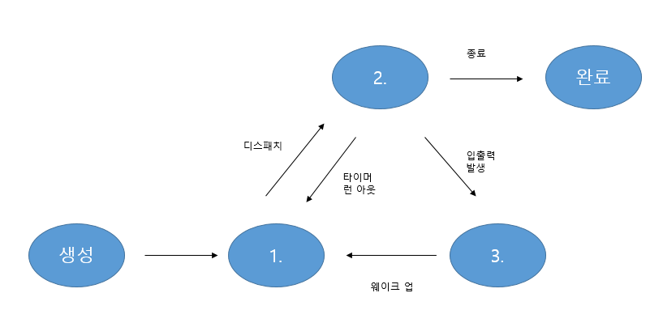

# 문제 13 — 프로세스 상태

## 문제

프로세스 상태 전이도에서 준비, 실행, 대기 상태를 번호에 맞게 쓰시오.

## 정답

1 준비; 2 실행; 3 대기

<strong>상세 해설</strong>

## 핵심 개념

프로세스는 CPU 할당을 기다리는 준비, CPU에서 수행되는 실행, 입출력 등 사건을 기다리는 대기 상태 사이를 이동한다.

## 풀이

원문 상태 전이도에서 각 번호 위치를 읽어 준비, 실행, 대기를 대응한다.

## 오답 분석

종료 상태는 수행이 끝난 상태이며 대기는 CPU 할당을 기다리는 준비와 다르다.

## 암기 포인트

CPU 대기는 준비, I/O 대기는 대기.

---
