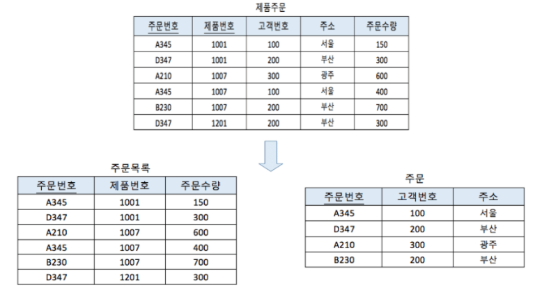

# 문제 04 — 제2정규형

## 문제

부분 함수적 종속성을 제거하고 모든 비주요 속성이 기본키 전체에 완전 함수 종속되도록 하는 정규형을 쓰시오.

<strong>정답 보기</strong>

제2정규형 (2NF)

<strong>상세 해설</strong>

## 핵심 개념

제2정규형은 1NF를 만족하며 후보키의 진부분집합에 대한 부분 함수 종속을 제거한 상태다.

## 풀이

복합키 일부만으로 결정되는 속성을 별도 릴레이션으로 분리해 완전 함수 종속을 만든다.

## 오답 분석

제3정규형은 이행 종속을 제거한다. 단일 속성 기본키라면 부분 종속 문제가 생기지 않는다.

## 암기 포인트

부분 종속 제거는 2NF.

---
