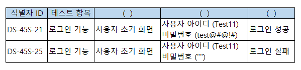

# 문제 08 — 테스트 케이스 구성요소

## 문제

테스트 케이스를 정의할 때 조건, 입력값, 실행 뒤 비교할 결과의 세 요소를 쓰시오.

## 정답

테스트 조건; 테스트 데이터; 예상 결과

<strong>상세 해설</strong>

## 핵심 개념

테스트 케이스는 특정 요구를 검증하기 위한 조건과 입력, 기대되는 결과를 정리한다.

## 풀이

조건은 검증할 상황, 데이터는 입력값, 예상 결과는 판정 기준이다.

## 오답 분석

실제 결과는 프로그램 실행 뒤 관찰하는 값이며, 사전에 정하는 예상 결과와 다르다.

## 암기 포인트

조건·데이터·예상 결과를 준비한다.

---

출처: [Life-Journey,   정보처리기사 실기 복원 문제](https://chobopark.tistory.com/217) (원문에 CC BY 4.0 표기)