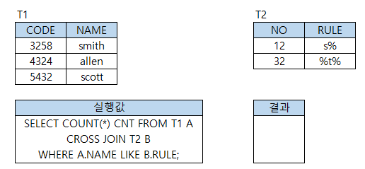

# 문제 13 — CROSS JOIN 결과 건수

## 문제

두 조건 검색 결과의 행을 CROSS JOIN한 결과에서 이름 조건에 맞는 행이 각각 2개씩이면 최종 결과 건수를 구하시오.

<strong>정답 보기</strong>

4

<strong>상세 해설</strong>

## 핵심 개념

CROSS JOIN은 두 결과 집합의 모든 조합을 만든다. 결과 행 수는 왼쪽 행 수와 오른쪽 행 수의 곱이다.

## 풀이

각 조건에서 2개씩 행이 선택되므로 2×2=4행이다.

## 오답 분석

조건별 합 2+2가 아니라 조합의 곱을 계산한다.

## 암기 포인트

CROSS JOIN 행 수는 두 집합 크기의 곱.

---
