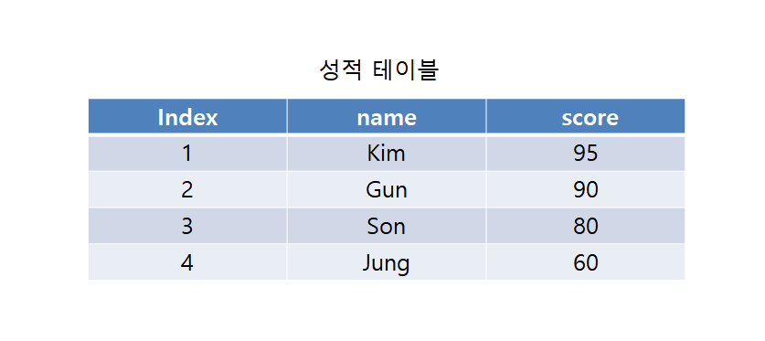

# 문제 04

## 문제

성적 테이블에서 name과 score를 조회하고 score 내림차순으로 정렬하는 쿼리를 완성하시오.

<strong>정답 보기</strong>

SELECT name, score FROM 성적 ORDER BY score DESC;

<strong>상세 해설</strong>

## 핵심 개념

ORDER BY는 결과 행의 정렬 기준을 지정한다. DESC는 내림차순, ASC 또는 생략은 오름차순이다.

## 풀이

FROM 성적 뒤에 ORDER BY score DESC를 둔다.

## 오답 분석

WHERE는 행을 거르고 GROUP BY는 그룹을 만든다. 정렬은 ORDER BY 절이다.

## 암기 포인트

내림차순은 DESC.

---
