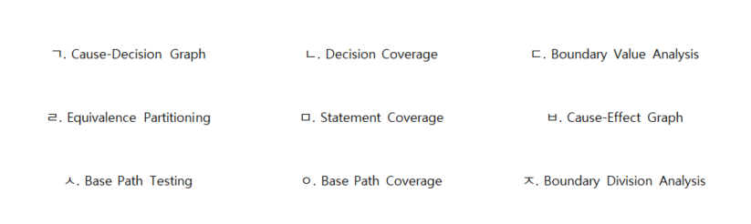

# 문제 13 — 블랙박스 테스트 기법

## 문제

보기 중 블랙박스 테스트 기법 세 가지의 문자를 쓰시오.

## 정답

ㄷ, ㄹ, ㅂ: 경계값 분석, 동등 분할, 원인-결과 그래프

<strong>상세 해설</strong>

## 핵심 개념

블랙박스 테스트는 내부 코드 구조보다 요구사항과 입출력 명세에 기반해 테스트한다.

## 풀이

보기에서 경계값 분석, 동등 분할, 원인-결과 그래프가 해당하므로 ㄷ, ㄹ, ㅂ이다.

## 오답 분석

문장 커버리지, 분기 커버리지, 기본 경로 테스트는 구조를 확인하는 화이트박스 기법이다.

## 암기 포인트

명세 기반의 경계값·동등분할·원인결과 그래프.

---
