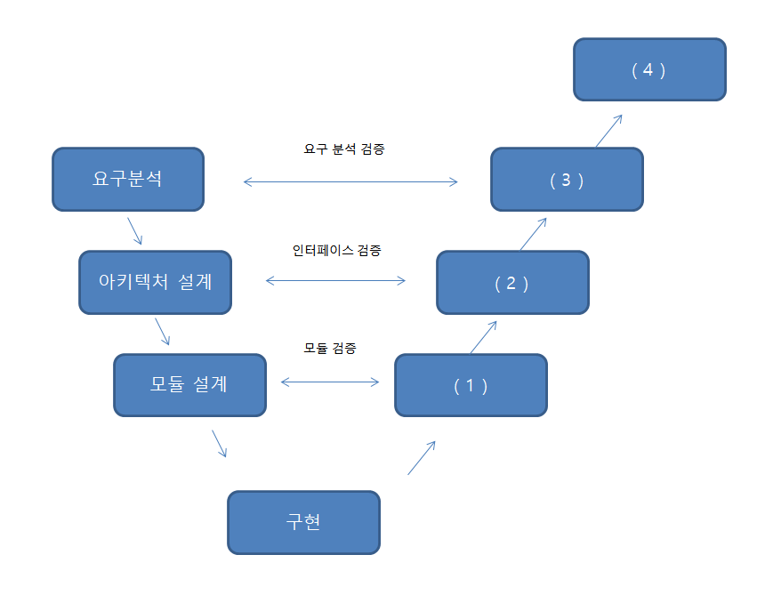

# 문제 20

## 문제

하위 모듈에서 상위 모듈 방향으로 진행하는 통합 테스트 방식과, 아직 존재하지 않는 상위 모듈 대신 호출 역할을 하는 보조 프로그램을 쓰시오.

<strong>정답 보기</strong>

상향식; 테스트 드라이버

<strong>상세 해설</strong>

## 핵심 개념

상향식 통합 테스트는 하위 모듈부터 통합하며, 상위 모듈이 준비되지 않은 동안 테스트 드라이버가 호출을 대신한다.

## 풀이

첫 빈칸은 상향식이고 두 번째는 테스트 드라이버다.

## 오답 분석

하향식 테스트는 아직 없는 하위 모듈을 대신할 스텁이 필요하다.

## 암기 포인트

상향식은 드라이버, 하향식은 스텁.

---
