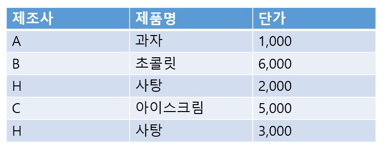

# 문제 03

## 문제

H회사의 모든 제품 단가보다 큰 제품을 조회하는 SQL에서 괄호에 들어갈 집합 비교 연산자를 쓰시오. 단가 > 괄호 (SELECT 단가 FROM 제품 WHERE 제조사='H')

<strong>정답 보기</strong>

ALL

<strong>상세 해설</strong>

## 핵심 개념

ALL은 하위 질의가 반환하는 모든 값과 비교한다. 따라서 > ALL은 H회사의 각 제품 단가보다 모두 큰 행을 찾는다.

## 풀이

하위 질의가 여러 행을 반환할 수 있는 다중 행 비교다. > ALL은 최댓값보다 커야 하고, < ALL은 최솟값보다 작아야 한다.

## 오답 분석

ANY 또는 SOME은 하나 이상의 값에 대해 조건이 참이면 된다. 단일 값 하위 질의의 일반 비교 연산자와 구분한다.

## 암기 포인트

ALL은 전부, ANY는 하나라도 만족.

---
