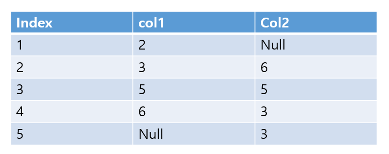

# 문제 04 — COUNT와 NULL 처리

## 문제

표의 행을 기준으로 SELECT count(col2) FROM TABLE WHERE col1 in(2,3) or col2 in(3,5);의 결과를 구하시오.

## 정답

4

<strong>상세 해설</strong>

## 핵심 개념

조건을 만족하는 행 중 col2가 NULL이 아닌 값만 COUNT에 포함한다. 결과는 4다.

## 풀이

조건 일치 행은 col1=2 행, col1=3 행, col2=5 행, col2=3인 두 행이다. 첫 번째 행의 col2는 NULL이라 제외하고 나머지 네 값을 센다.

## 오답 분석

COUNT(*)는 조건에 맞는 행 수를 센다. COUNT(열)은 해당 열의 NULL을 제외하며, OR는 두 조건 중 하나라도 참이면 통과한다.

## 암기 포인트

COUNT(*)는 행 수, COUNT(열)은 NULL 제외.

---
