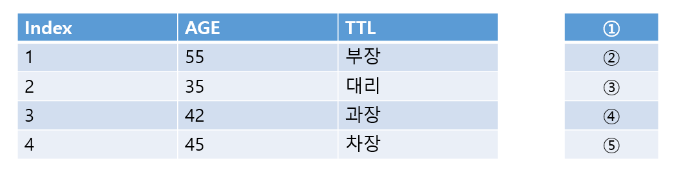

# 문제 12

## 문제

employee 릴레이션에 대해 πTTL(employee)를 수행한 결과를 쓰시오.

<strong>정답 보기</strong>

TTL, 부장, 대리, 과장, 차장

<strong>상세 해설</strong>

## 핵심 개념

프로젝션은 릴레이션에서 지정한 속성 열만 추출하며 중복 튜플을 제거한다.

## 풀이

TTL 속성만 남기고 중복을 제거한다. 원문 표의 서로 다른 값은 TTL, 부장, 대리, 과장, 차장이다.

## 오답 분석

셀렉션 σ는 조건에 맞는 행을 고르는 연산이다. π는 열을 선택하는 연산이다.

## 암기 포인트

π는 열, σ는 행.

---
