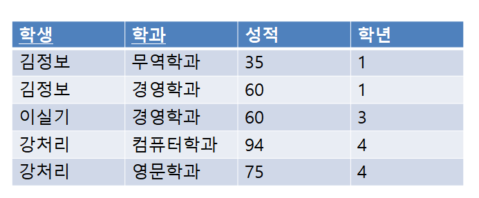

# 문제 18 — 함수 종속성 유형

## 문제

성적이 {학생, 학과} 전체에 종속되는 경우, 학과만으로 결정되어 기본키 일부에 종속되는 경우, X→Y와 Y→Z에서 X→Z가 성립하는 경우의 종속 유형을 쓰시오.

## 정답

완전 함수 종속; 부분 함수 종속; 이행 함수 종속

<strong>상세 해설</strong>

## 핵심 개념

완전 함수 종속은 복합 기본키 전체에 의존하고, 부분 함수 종속은 키 일부에만 의존한다. 이행 함수 종속은 X→Y와 Y→Z를 통해 X→Z가 성립하는 관계다.

## 풀이

세 설명의 핵심 표현인 전체 키, 일부 키, 연쇄적 결정 관계에 대응시킨다.

## 오답 분석

다치 종속은 속성 집합 사이의 독립적인 다중 값 관계로, 문제의 세 정의와 다르다.

## 암기 포인트

전체는 완전, 일부는 부분, 연쇄는 이행.

---

출처: [Life-Journey, 2022년 2회 정보처리기사 실기 복원 문제](https://chobopark.tistory.com/423) (원문에 CC BY 4.0 표기)