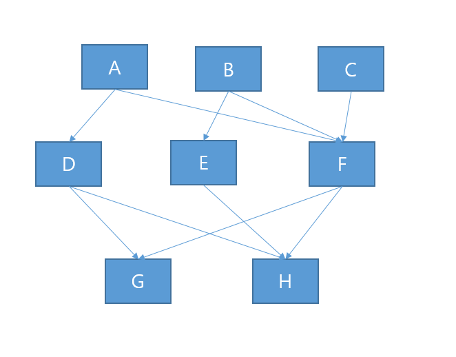

# 문제 20 — Fan-in과 Fan-out

## 문제

모듈도에서 F 모듈로 들어오는 직접 호출 수와 F가 직접 호출하는 다른 모듈 수를 구하시오.

<strong>정답 보기</strong>

Fan-in 3; Fan-out 2

<strong>상세 해설</strong>

## 핵심 개념

Fan-in은 특정 모듈을 호출하는 상위 모듈 수, Fan-out은 해당 모듈이 직접 호출하는 하위 모듈 수다.

## 풀이

원문 모듈도에서 F로 연결되는 호출선이 3개이고 F에서 다른 모듈로 나가는 호출선은 2개다. 화살표 방향을 기준으로 센다.

## 오답 분석

도달 가능한 전체 모듈 수가 아니라 직접 연결만 센다. 동일 모듈 호출 횟수와 연결된 모듈의 수를 구분한다.

## 암기 포인트

들어오는 선은 Fan-in, 나가는 선은 Fan-out.

---
