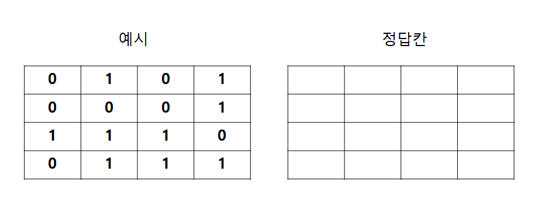

# 문제 01 — 지뢰찾기 인접 개수

## 문제

field의 1을 지뢰로 보고 주변 8칸의 지뢰 수를 mines에 기록한 4×4 결과를 쓰시오.

## 정답

1 1 3 2 / 3 4 5 3 / 3 5 6 4 / 3 5 5 3

<strong>상세 해설</strong>

## 핵심 개념

각 지뢰 셀을 기준으로 경계 안에 있는 주변 셀을 모두 세어 누적한다.

## 풀이

field의 각 1에 대해 주변 좌표를 순회하며 calculate가 유효 좌표인지 확인한다. 유효한 주변 mines 칸만 1씩 증가시킨다. 결과는 행별로 1 1 3 2, 3 4 5 3, 3 5 6 4, 3 5 5 3이다.

## 오답 분석

바깥 좌표는 calculate가 걸러낸다. 지뢰 자신도 3×3 주변 범위에 포함되므로 값이 0인 칸에 주변 지뢰 수가 누적된다.

## 암기 포인트

주변 8칸과 자기 칸 포함, 배열 경계 확인.

---

출처: [Life-Journey, 2022년 3회 정보처리기사 실기 문제](https://chobopark.tistory.com/424) (CC BY 4.0 표기)