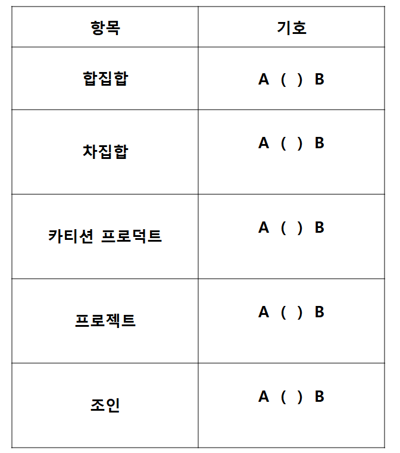

# 문제 02

## 문제

합집합, 차집합, 카티션 프로덕트, 프로젝션, 조인의 기호를 쓰시오.

<strong>정답 보기</strong>

U, −, ×, π, ⋈

<strong>상세 해설</strong>

## 핵심 개념

관계 대수 기호는 집합 연산과 릴레이션 연산을 구분해 나타낸다.

## 풀이

합집합은 ∪(원문 표기 U), 차집합은 −, 카티션 곱은 ×, 프로젝션은 π, 조인은 ⋈다.

## 오답 분석

셀렉션 σ는 행을 선택하는 기호이므로 프로젝션 π와 혼동하지 않는다.

## 암기 포인트

열 π, 행 σ, 조인 ⋈.

---
