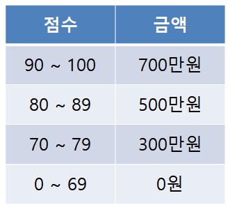
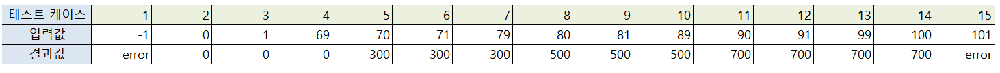

# 문제 06

## 문제

입력 범위의 경계와 바로 인접한 값을 집중 테스트하는 기법을 쓰시오.

<strong>정답 보기</strong>

경계값 분석 (Boundary Value Analysis)

<strong>상세 해설</strong>

## 핵심 개념

경계값 분석은 오류가 자주 발생하는 구간 경계 주변을 테스트한다.

## 풀이

최솟값·최댓값, 경계 바로 안쪽·바깥쪽 값을 선택해 검사한다. 원문의 표가 나타내는 테스트 기법은 Boundary Value Analysis다.

## 오답 분석

동등 분할은 입력을 같은 동작 구간으로 나누고 대표값을 고른다. 경계 주변 집중은 경계값 분석이다.

## 암기 포인트

경계 주변 값을 시험하면 BVA.

---
