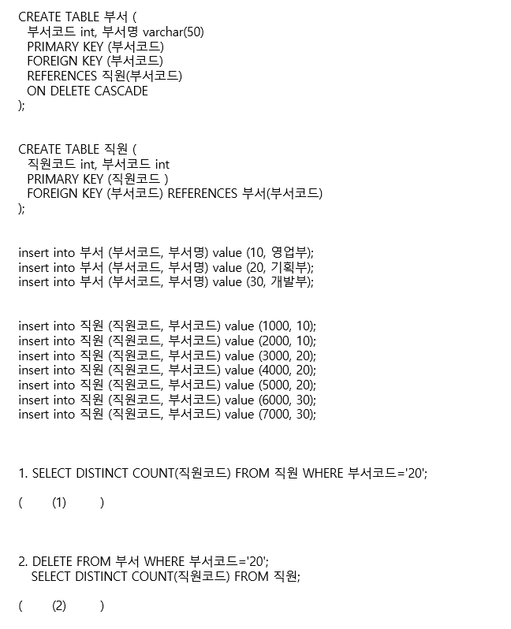

# 문제 07 — 외래키 CASCADE와 COUNT

## 문제

부서코드 20을 조건으로 한 COUNT와 부서 행 삭제 후 직원 COUNT 결과를 구하시오.

## 정답

(1) 3 (2) 4

<strong>상세 해설</strong>

## 핵심 개념

COUNT는 조건을 만족하는 행 수를 세고 ON DELETE CASCADE는 부모 삭제에 따라 자식 행도 삭제한다.

## 풀이

직원 테이블에서 부서코드 20인 직원은 3000,4000,5000 세 명이므로 첫 COUNT는 3이다. 부서코드 20의 부서를 삭제하면 외래키 CASCADE로 해당 직원 세 행도 제거된다. 남은 직원은 10번 부서 두 명과 30번 부서 두 명, 합계 4명이다.

## 오답 분석

COUNT DISTINCT는 결과 행이 아니라 고유 값을 세지만 직원코드는 기본키라 이 경우 세 명이다. CASCADE 삭제 범위는 연결된 직원 행이다.

## 암기 포인트

부서 20 인원 3, 연쇄 삭제 후 나머지 4.

---

출처: [Life-Journey, 2022년 3회 정보처리기사 실기 문제](https://chobopark.tistory.com/424) (CC BY 4.0 표기)