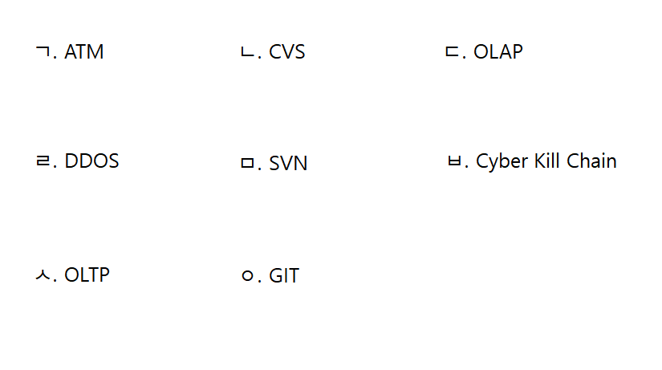

# 문제 11 — 형상 관리 도구

## 문제

버전 관리와 형상 관리에 사용하는 세 도구를 고르시오.

## 정답

CVS, SVN, Git

<strong>상세 해설</strong>

## 핵심 개념

형상 관리 도구는 소스코드와 변경 이력을 추적한다.

## 풀이

CVS와 Subversion(SVN), Git은 파일 변경 이력과 버전을 관리하고 여러 개발자의 협업을 지원한다.

## 오답 분석

컴파일러나 테스트 도구가 아니라 버전 관리 시스템 이름을 선택한다.

## 암기 포인트

CVS·SVN·Git은 형상 관리.

---

출처: [Life-Journey, 2022년 3회 정보처리기사 실기 문제](https://chobopark.tistory.com/424) (CC BY 4.0 표기)