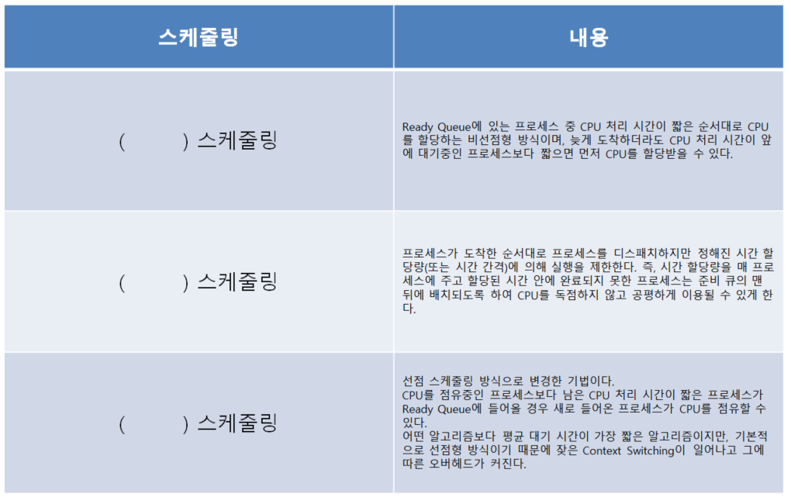

# 문제 16 — 스케줄링 알고리즘

## 문제

세 알고리즘의 이름을 그림 단서에 맞춰 쓰시오.

## 정답

SJF, RR, SRT

<strong>상세 해설</strong>

## 핵심 개념

SJF는 실행시간이 가장 짧은 작업, RR은 시간 할당량 순환, SRT는 남은 시간이 짧은 작업을 선택한다.

## 풀이

SJF는 비선점형 최단작업우선, RR은 각 프로세스에 타임퀀텀을 주고 순환, SRT는 선점형 최단 잔여시간 우선이다.

## 오답 분석

SJF와 SRT를 같은 알고리즘으로 보면 안 된다. SRT는 도착·선점 시 남은 실행시간을 비교한다.

## 암기 포인트

짧은 작업 SJF, 순환 RR, 남은 시간 SRT.

---
