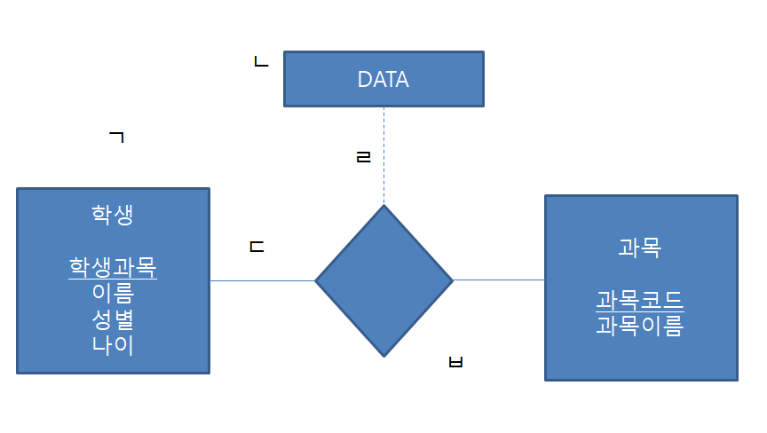

# 문제 18

## 문제

개체·관계·속성 도형과 연결선의 의미를 각각 쓰시오.

<strong>정답 보기</strong>

1. 실선 2. 관계집합 3. 점선 4. 관계집합 속성 5. 개체집합

<strong>상세 해설</strong>

## 핵심 개념

E-R 표기에서 사각형·마름모·타원과 연결선은 개체·관계·속성을 나타낸다.

## 풀이

개체집합과 관계집합은 실선으로 연결된다. 개체 연결의 마름모는 관계집합, 관계와 속성의 점선 연결은 관계집합 속성을 나타낸다. 같은 속성을 공유하는 개체들의 모임은 개체집합이다.

## 오답 분석

속성은 타원, 개체집합은 사각형, 관계집합은 마름모로 구분한다.

## 암기 포인트

사각형 개체, 마름모 관계, 타원 속성.

---
