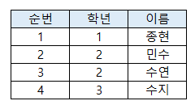

# 문제 13

## 문제

학생 테이블에서 이름이 민수인 행을 삭제하는 SQL문을 쓰시오.

<strong>정답 보기</strong>

DELETE FROM 학생 WHERE 이름='민수';

<strong>상세 해설</strong>

## 핵심 개념

DELETE는 조건을 만족하는 행을 제거하며 문자열 비교값은 작은따옴표로 감싼다.

## 풀이

테이블 학생에서 WHERE 조건이 참인 튜플만 삭제한다. 이름이 민수인 행에 적용한다.

## 오답 분석

조건 없이 DELETE FROM 학생을 실행하면 모든 행이 삭제된다. 특정 행 삭제에는 WHERE가 필요하다.

## 암기 포인트

행 삭제는 DELETE FROM + WHERE.

---
