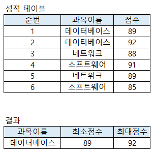

# 문제 16 — SQL GROUP BY HAVING

## 문제

과목별 평균이 90 이상인 과목의 과목명, 최소·최대점수를 구하는 SQL을 쓰시오.

## 정답

SELECT 과목이름, MIN(점수) AS 최소점수, MAX(점수) AS 최대점수 FROM 성적 GROUP BY 과목이름 HAVING AVG(점수)>=90

<strong>상세 해설</strong>

## 핵심 개념

그룹별 집계 조건은 WHERE가 아니라 HAVING으로 쓴다.

## 풀이

과목이름별로 그룹을 만든 뒤 MIN과 MAX를 집계해 별칭으로 출력한다. AVG(점수)>=90인 그룹만 HAVING으로 남긴다.

## 오답 분석

WHERE는 그룹화 전 행을 거른다. 문제는 WHERE를 금지하고 평균이라는 집계 결과를 필터하므로 HAVING이 맞다.

## 암기 포인트

집계 후 조건은 HAVING.

---

출처: [Life-Journey, 2023년 1회 정보처리기사 실기 복원 문제](https://chobopark.tistory.com/372) (CC BY 4.0 표기)