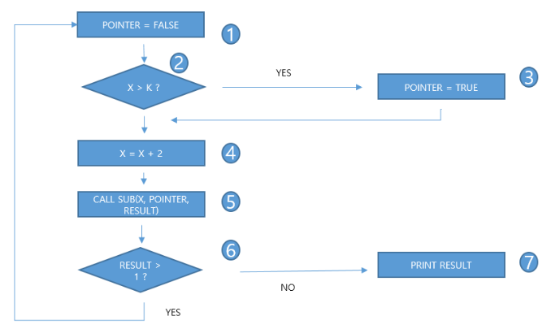

# 문제 19 — 분기 커버리지 경로

## 문제

제어 흐름 그래프의 모든 분기 결과를 포함하는 두 테스트 경로를 쓰시오.

## 정답

1234561, 124567 또는 1234567, 124561

<strong>상세 해설</strong>

## 핵심 개념

분기 커버리지는 각 결정의 가능한 출구를 적어도 한 번씩 실행한다.

## 풀이

하나의 경로가 한 갈래를 지나고 다른 경로가 반대쪽 갈래를 지나가도록 두 경로를 묶는다. 원문 그래프에서 허용되는 조합은 1234561과 124567 또는 1234567과 124561이다.

## 오답 분석

같은 분기를 두 번 밟고 반대편 분기를 빠뜨리면 분기 커버리지를 만족하지 않는다.

## 암기 포인트

각 분기 출구를 두 경로로 모두 통과.

---

출처: [Life-Journey, 2023년 1회 정보처리기사 실기 복원 문제](https://chobopark.tistory.com/372) (CC BY 4.0 표기)