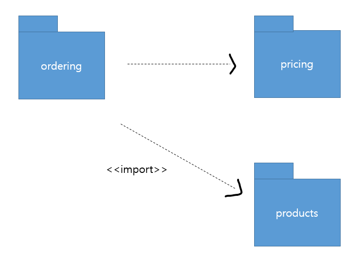

# 문제 15 — UML 패키지 다이어그램

## 문제

판매 기능의 모델 요소를 패키지 단위로 묶어 의존 관계를 나타낸 UML 다이어그램 이름을 쓰시오.

<strong>정답 보기</strong>

패키지 다이어그램

<strong>상세 해설</strong>

## 핵심 개념

패키지 다이어그램은 관련 모델 요소를 패키지로 그룹화하고 패키지 간 의존성을 나타낸다.

## 풀이

시스템의 네임스페이스와 모듈 구성을 패키지 단위로 보여준다. 판매 업무 구성 요소를 패키지로 묶은 그림은 패키지 다이어그램이다.

## 오답 분석

클래스의 속성·연산을 보여주는 클래스 다이어그램이나 사용자 기능을 보여주는 유스케이스 다이어그램과 구분한다.

## 암기 포인트

패키지 묶음과 의존성은 패키지 다이어그램.

---
