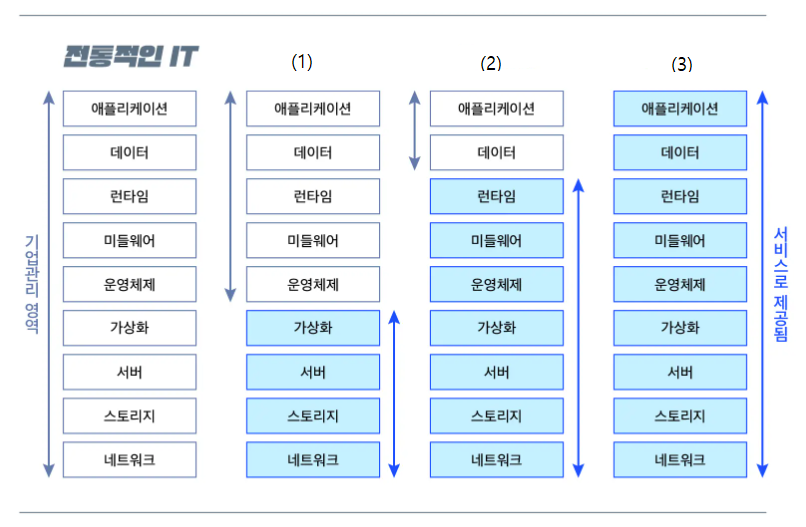

# 문제 17 — 클라우드 서비스 모델

## 문제

인프라, 플랫폼, 완성 소프트웨어를 서비스하는 세 클라우드 모델을 순서대로 쓰시오.

## 정답

IaaS, PaaS, SaaS

<strong>상세 해설</strong>

## 핵심 개념

IaaS는 가상화 인프라, PaaS는 개발·실행 플랫폼, SaaS는 애플리케이션을 제공한다.

## 풀이

사용자는 IaaS에서 운영체제와 앱을 관리하고, PaaS에서는 앱과 데이터를 주로 관리하며, SaaS에서는 완성된 응용 서비스를 이용한다.

## 오답 분석

서비스 추상화가 높아질수록 관리할 기반 요소는 줄어든다. IaaS→PaaS→SaaS 순서다.

## 암기 포인트

인프라→플랫폼→소프트웨어.

---
