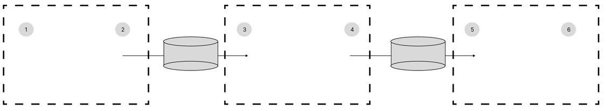

# 문제 05 — 서브넷 할당 주소

## 문제

주어진 IP와 프리픽스가 속한 라우터 네트워크의 사용 가능한 보기 주소를 고르시오.

## 정답

2) 192.168.35.72, 4) 129.200.8.249, 5) 192.168.36.249

<strong>상세 해설</strong>

## 핵심 개념

호스트 주소가 해당 서브넷의 네트워크 주소나 브로드캐스트 주소가 아니면 할당 가능하다.

## 풀이

192.168.35.3/24는 192.168.35.0/24에 속하므로 .72가 호스트 주소다. 129.200.10.16/22의 네트워크는 129.200.8.0/22이며 .249는 유효 호스트다. 192.168.36.24/24에서 .249도 유효 호스트다. 각 네트워크 주소 자체는 할당할 수 없다.

## 오답 분석

보기의 .0 주소들은 각 서브넷 네트워크 주소여서 호스트에 줄 수 없다.

## 암기 포인트

네트워크 주소와 브로드캐스트 주소는 호스트 할당 불가.

---

출처: [Life-Journey, 2024년 1회 정보처리기사 실기 복원 문제](https://chobopark.tistory.com/476) (CC BY 4.0 표기)