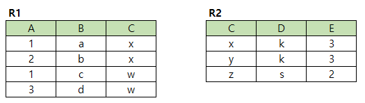

# 문제 13

## 문제

D가 k인 R2 행들의 C값과 같은 R1 행에서 B를 선택한 결과를 쓰시오.

<strong>정답 보기</strong>

a, b

<strong>상세 해설</strong>

## 핵심 개념

IN 서브쿼리는 집합에 포함되는지 검사하며, 바깥 테이블 행 중 C가 그 집합에 속한 행을 고른다.

## 풀이

R2에서 D='k'인 행의 C값을 구한다. R1에서 C가 해당 값인 튜플을 찾으면 B열 값은 a와 b다.

## 오답 분석

서브쿼리는 R2의 C값 집합을 반환한다. 바깥 쿼리가 R2 전체를 반환하는 것이 아니다.

## 암기 포인트

먼저 내부 C 집합, 다음 R1에서 IN 필터.

---
