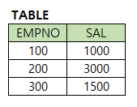

# 문제 18 — SQL 연산자 우선순위

## 문제

EMPNO>100 AND SAL>=3000 OR EMPNO=200 조건의 COUNT 결과를 구하시오.

## 정답

1

<strong>상세 해설</strong>

## 핵심 개념

AND는 OR보다 먼저 평가되므로 조건은 (A AND B) OR C로 해석한다.

## 풀이

행마다 (EMPNO>100 그리고 SAL>=3000) 또는 EMPNO=200인지 판단한다. 표에서 이 조건을 만족하는 행은 한 개다.

## 오답 분석

괄호가 없다고 왼쪽부터 모두 같은 우선순위로 처리하면 안 된다. SQL에서 AND가 OR보다 우선한다.

## 암기 포인트

AND 먼저, OR 나중.

---
