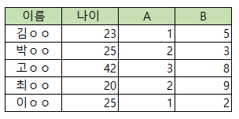

# 문제 04

## 문제

표의 행 수와 속성 수를 각각 쓰시오.

<strong>정답 보기</strong>

카디널리티 5, 차수 4

<strong>상세 해설</strong>

## 핵심 개념

카디널리티는 튜플 수, 차수는 속성 수다.

## 풀이

표에서 데이터 행은 5개, 열은 4개다. 따라서 카디널리티는 5이고 차수는 4다.

## 오답 분석

헤더를 행으로 세지 말고, 열 수와 튜플 수를 뒤바꾸지 않는다.

## 암기 포인트

행=카디널리티, 열=차수.

---
