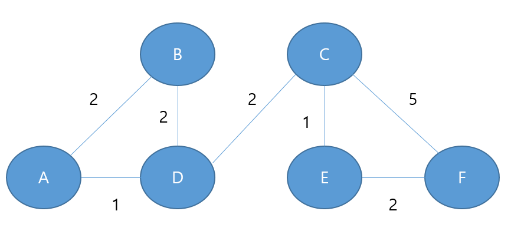

# 문제 11 — RIP 최단 경로

## 문제

그림의 네트워크에서 RIP 기준으로 A에서 F까지 최소 비용 경로를 적으시오.

## 정답

A → D → C → F

<strong>상세 해설</strong>

## 핵심 개념

RIP은 홉 수를 거리 벡터 메트릭으로 사용하고 더 짧은 경로를 선택한다.

## 풀이

그림의 링크 비용·홉을 비교해 A에서 D, D에서 C, C에서 F로 이동하는 경로가 최소 경로로 남는다. 경로를 중간 노드까지 포함해 순서대로 적는다.

## 오답 분석

직접 링크만 보거나 숫자 비용의 합을 최단거리 방식처럼 비교하지 않는다. RIP 문제의 기본 메트릭은 홉 수다.

## 암기 포인트

RIP은 홉 수, 경로 순서를 정확히.

---
