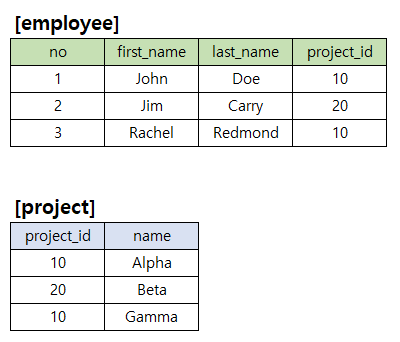

# 문제 03 — SQL 그룹 조건과 조인

## 문제

프로젝트별 직원 수가 2명 미만인 프로젝트와 조인해 해당 직원 행 수를 세는 SQL 결과를 구하시오.

## 정답

1

<strong>상세 해설</strong>

## 핵심 개념

GROUP BY와 HAVING으로 조건을 만족하는 프로젝트를 고르고, 그 프로젝트 소속 직원을 조인해 센다.

## 풀이

서브쿼리는 employee를 project_id별로 묶고 COUNT(*)<2인 프로젝트 id를 찾는다. 해당 프로젝트의 이름을 구한 뒤 바깥 쿼리에서 같은 프로젝트에 소속된 직원과 결합한다. 복원 표에서 조건을 만족하는 직원 행은 하나다.

## 오답 분석

HAVING은 그룹 집계 후 필터다. 프로젝트 수가 아니라 조인 결과 직원 행을 COUNT(*)로 센다.

## 암기 포인트

먼저 프로젝트별 직원 수를 필터하고 바깥 COUNT 결과를 센다.

---
