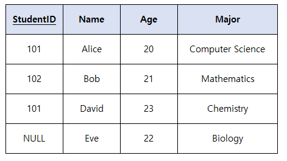

# 문제 08 — 개체 무결성

## 문제

기본키 값이 NULL인 행이 있는 표가 위반한 무결성을 쓰시오.

## 정답

개체 무결성

<strong>상세 해설</strong>

## 핵심 개념

개체 무결성은 기본키가 NULL이 아니고 유일해야 한다.

## 풀이

기본키는 각 튜플을 식별하는 식별자다. 값이 NULL이면 행을 고유하게 식별할 수 없으므로 개체 무결성 위반이다.

## 오답 분석

외래키 참조 대상 부재는 참조 무결성, 값의 형식이나 범위 위반은 도메인 무결성이다.

## 암기 포인트

기본키 NULL/중복은 개체 무결성.

---

출처: [Life-Journey, 2024년 3회 정보처리기사 실기 복원 문제](https://chobopark.tistory.com/495) (CC BY 4.0 표기)