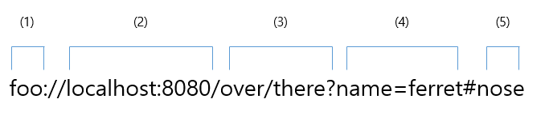

# 문제 09 — URL 구성요소

## 문제

query, path, scheme, authority, fragment의 순서로 URL 그림의 각 구성요소 번호를 쓰시오.

<strong>정답 보기</strong>

43125

<strong>상세 해설</strong>

## 핵심 개념

URL은 scheme://authority/path?query#fragment 형태로 읽는다.

## 풀이

구성요소 번호에서 scheme은 1, authority는 2, path는 3, query는 4, fragment는 5다. 문제의 요청 순서 query, path, scheme, authority, fragment를 대입하면 4-3-1-2-5다.

## 오답 분석

URL에서 ? 뒤는 query, # 뒤는 fragment다. authority는 호스트와 선택적인 사용자·포트 정보를 포함한다.

## 암기 포인트

URL 형태: scheme://authority/path?query#fragment.

---
