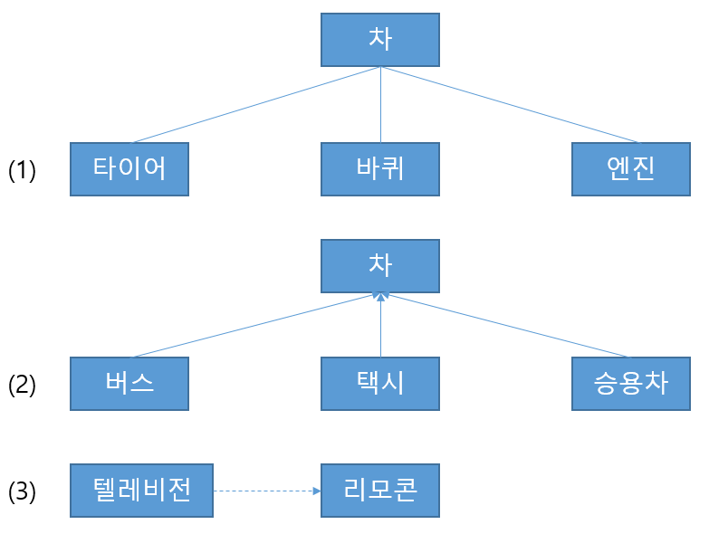

# 문제 14 — UML 관계

## 문제

클래스 다이어그램의 관계 그림 세 가지를 연관, 일반화, 의존 중 골라 순서대로 답하시오.

<strong>정답 보기</strong>

연관, 일반화, 의존

<strong>상세 해설</strong>

## 핵심 개념

연관은 지속적 관계, 일반화는 상속, 의존은 일시적 사용 관계를 나타낸다.

## 풀이

실선으로 연결된 구조적 관계는 연관, 빈 삼각형 화살표 방향은 일반화, 점선 화살표는 의존 관계로 읽는다. 그림의 세 표시는 각각 연관, 일반화, 의존이다.

## 오답 분석

의존과 연관은 모두 연결로 표현될 수 있지만 의존은 한 요소가 다른 요소를 일시적으로 사용하는 관계다. 일반화의 빈 삼각형도 구분한다.

## 암기 포인트

빈 삼각형=일반화, 점선 화살표=의존.

---
