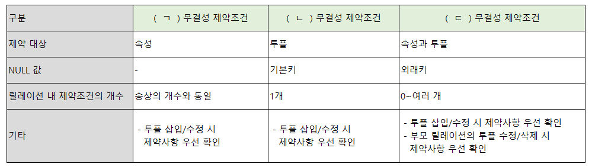

# 문제 02 — 무결성 제약조건

## 문제

도메인, 개체, 참조 무결성의 세 가지 제약조건 용어를 설명에 맞춰 배열하시오.

## 정답

도메인 무결성, 개체 무결성, 참조 무결성

<strong>상세 해설</strong>

## 핵심 개념

도메인은 속성값의 범위, 개체는 기본키, 참조는 외래키와 다른 릴레이션의 연결을 지킨다.

## 풀이

도메인 무결성은 각 속성이 미리 정한 자료형과 허용 범위 안의 값을 갖게 한다. 개체 무결성은 기본키가 NULL이거나 중복되지 않게 한다. 참조 무결성은 외래키 값이 참조 대상 기본키에 존재하거나 NULL 허용 규칙을 따르게 한다.

## 오답 분석

세 용어를 혼동해도 기준은 명확하다. 값 범위면 도메인, 기본키면 개체, 외래키 연결이면 참조다.

## 암기 포인트

도메인 값, 개체 기본키, 참조 외래키.

---

출처: [Life-Journey, 2025년 1회 정보처리기사 실기 복원 문제](https://chobopark.tistory.com/540) (CC BY 4.0 표기)