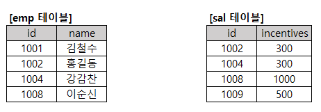

# 문제 07 — 등가 조인과 조건 검색

## 문제

emp와 sal을 id로 조인하고 incentive가 500 이상인 행에서 이름과 인센티브를 구하시오.

## 정답

이순신, 1000

<strong>상세 해설</strong>

## 핵심 개념

조인 조건으로 두 테이블의 동일 id 행을 결합한 뒤 WHERE 조건을 적용한다.

## 풀이

emp.id=sal.id인 행끼리 짝을 만든다. 이어 incentives>=500 조건을 만족하는 행만 남기므로 표에서 남는 인물은 이순신이고 인센티브는 1000이다. 결과 열은 이름과 인센티브다.

## 오답 분석

조인 전후의 행을 혼동하거나 500 미만 행까지 포함하면 안 된다. SQL은 WHERE 조건을 만족하는 행만 결과에 남긴다.

## 암기 포인트

먼저 id로 결합, 그 다음 500 이상 필터.

---

출처: [Life-Journey, 2025년 1회 정보처리기사 실기 복원 문제](https://chobopark.tistory.com/540) (CC BY 4.0 표기)