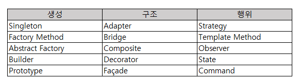

# 문제 14 — 어댑터 패턴

## 문제

서로 다른 인터페이스를 가진 기존 클래스를 대상 인터페이스에 맞춰 감싸 연결하는 디자인 패턴을 쓰시오.

## 정답

어댑터 패턴 (Adapter)

<strong>상세 해설</strong>

## 핵심 개념

어댑터는 호환되지 않는 인터페이스 사이에서 변환 역할을 한다.

## 풀이

클라이언트가 요구하는 Target 인터페이스를 어댑터가 구현하고, 내부적으로 기존 Adaptee 기능을 호출해 결과를 변환한다. 기존 클래스의 기능을 재사용하면서 인터페이스 차이를 흡수한다.

## 오답 분석

데코레이터는 기능을 동적으로 덧붙이고, 프록시는 접근을 제어·대리한다. 인터페이스 변환이 핵심이면 어댑터다.

## 암기 포인트

호환되지 않는 두 인터페이스를 맞추는 Adapter.

---

출처: [Life-Journey, 2025년 1회 정보처리기사 실기 복원 문제](https://chobopark.tistory.com/540) (CC BY 4.0 표기)