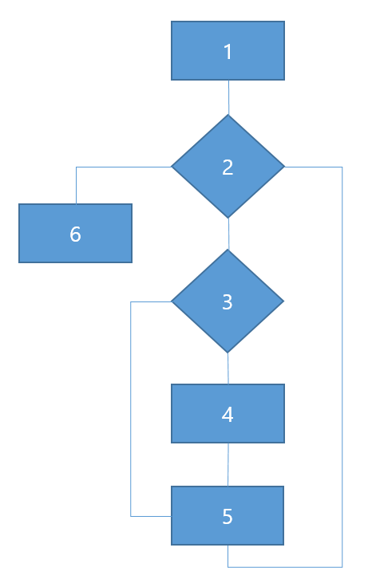

# 문제 15 — 문장 커버리지 제어 흐름

## 문제

모든 실행문을 한 번 이상 수행하는 제어 흐름 순서를 코드 흐름도 기준으로 쓰시오.

## 정답

① int a=0; ② a<m 

<strong>상세 해설</strong>

## 핵심 개념

## 풀이

 b[a]<x; ③ b[a]<0; ④ b[a]=-b[a]; ⑤ a++; ⑥ return 1; 순서: ③→④→⑤→②→⑥ (초기 ①→② 이후)

## 오답 분석

문장 커버리지는 각 실행문을 적어도 한 번 실행하는 테스트 기준이다.

## 암기 포인트

초기화 ① 뒤 while 조건 ②에 진입한다. if 조건 ③이 참이 되도록 음수 원소를 준비하면 대입문 ④가 실행되고, 반복 끝의 증가문 ⑤ 뒤 조건 ②로 돌아간다. 종료 조건을 만족하면 ⑥으로 간다. 그러므로 초기 흐름 이후 요구된 경로는 ③→④→⑤→②→⑥이다.|분기 커버리지처럼 각 조건의 참·거짓 출구를 반드시 모두 실행할 필요는 없다. 다만 ④를 실행시키려면 b[a]<0인 입력이 필요하다.|문장 커버리지: 각 문장을 최소 한 번.

---

출처: [Life-Journey, 2025년 1회 정보처리기사 실기 복원 문제](https://chobopark.tistory.com/540) (CC BY 4.0 표기)