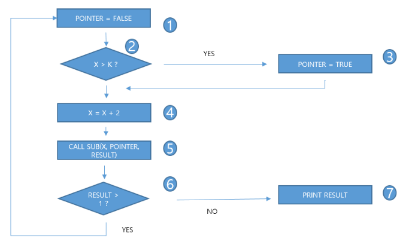

# 문제 11

## 문제

주어진 제어 흐름 그래프에서 각 분기를 한 번 이상 통과하는 테스트 경로를 쓰시오.

<strong>정답 보기</strong>

1234561, 124567 (또는 1234567, 124561)

<strong>상세 해설</strong>

## 핵심 개념

분기 커버리지는 문장 커버리지보다 강하며 각 분기 결과를 실행해야 한다.

## 풀이

분기 커버리지는 각 결정 지점의 가능한 출구를 모두 적어도 한 번씩 실행하는 기준이다. 원문 그래프의 두 분기 경로를 조합하면 제시된 경로 쌍 중 하나가 모든 분기를 지나간다. 노드 번호는 원본 그림을 따라 읽는다.

## 오답 분석

한 경로만으로 두 갈래 출구를 모두 지날 수 없는 그래프이므로 테스트 경로 두 개가 필요하다.

## 암기 포인트

분기 커버리지는 문장 커버리지보다 강하며 각 분기 결과를 실행해야 한다.

---
