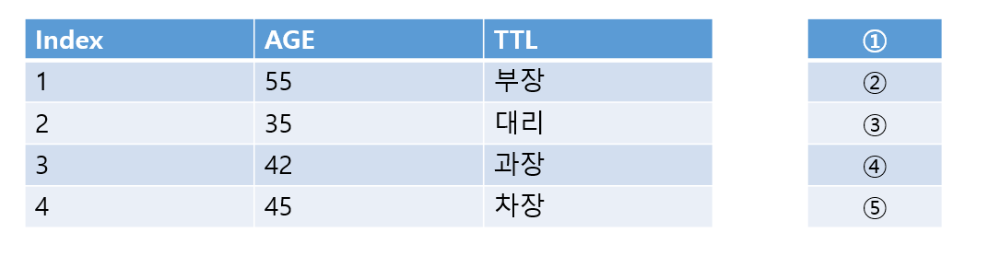

# 문제 20 — 관계 대수 프로젝션

## 문제

employee 테이블에 관계 대수 프로젝션 πTTL(employee)을 수행한 결과의 중복 제거 값 목록을 쓰시오.

## 원문 이미지

[원문 이미지와 표 보기](https://chobopark.tistory.com/554)

## 정답

TTL: 부장, 대리, 과장, 차장

<strong>상세 해설</strong>

## 핵심 개념

프로젝션 π는 열 선택, 셀렉션 σ는 행 선택이다. 관계 대수 결과는 중복을 제거한다.

## 풀이

π는 지정한 속성만 남기는 프로젝션이다. 관계 대수는 집합 의미를 사용하므로 같은 직급이 여러 행에 있어도 결과에는 한 번씩만 나타난다. 원문 테이블의 TTL 열에 나타나는 값은 TTL, 부장, 대리, 과장, 차장이다.

## 오답 분석

πTTL에서 TTL은 속성 이름이고 그 열의 실제 값들이 결과다. 원본 행 전체를 반환하지 않는다.

## 암기 포인트

프로젝션 π는 열 선택, 셀렉션 σ는 행 선택이다. 관계 대수 결과는 중복을 제거한다.

---

출처: [Life-Journey, 2025년 2회 정보처리기사 실기 복원 문제](https://chobopark.tistory.com/554) (CC BY 4.0 표기)