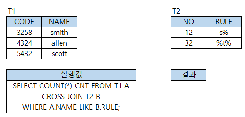

# 문제 10 — 테이블 조건 결과

## 문제

페이지에 표시된 테이블 조건 실행 화면을 보고 결과값을 작성하시오.

## 정답

4

<strong>상세 해설</strong>

## 핵심 개념

테이블 질의는 조건을 만족하는 행을 먼저 추린 뒤 집계 결과를 계산한다.

## 풀이

원문 페이지의 정답 표시는 4다. 표의 실제 열과 조건 화면은 원문 이미지에 있으므로 이미지에서 선택된 행과 집계/조건 결과를 확인한다.

## 오답 분석

표의 데이터가 빠지면 결과를 독립적으로 재계산할 수 없으므로 정답 숫자만 외우지 말고 원문 그림의 조건을 함께 확인한다.

## 암기 포인트

테이블 질의는 조건을 만족하는 행을 먼저 추린 뒤 집계 결과를 계산한다.

---
