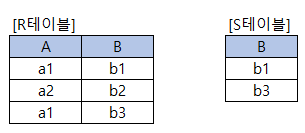

# 문제 14 — 관계 대수 나눗셈

## 문제

두 릴레이션 R과 S에 대한 관계 대수 나눗셈 R ÷ S의 결과 테이블을 쓰시오.

## 원문 이미지

[원문 문제 이미지와 표 확인](https://chobopark.tistory.com/558)

## 정답

A / a1

<strong>상세 해설</strong>

## 핵심 개념

관계 대수의 ÷는 “S의 모든 튜플에 대해 조건을 만족하는 R의 값”을 찾는 연산이다.

## 풀이

나눗셈은 S의 모든 값과 짝을 이루는 R의 후보를 반환한다. 원문 정답 표시는 A와 a1이다. 입력 릴레이션의 실제 행은 원문 이미지에서 확인해야 중간 계산을 검산할 수 있다.

## 오답 분석

나눗셈은 단순한 교집합이나 프로젝션과 다르며, S의 모든 조합을 만족해야 후보에 포함된다.

## 암기 포인트

관계 대수의 ÷는 “S의 모든 튜플에 대해 조건을 만족하는 R의 값”을 찾는 연산이다.

---
