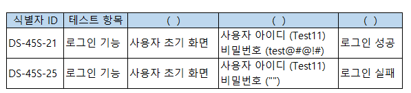

# 문제 19 — 테스트 케이스 구성요소

## 문제

원문 도식에 제시된 테스트 케이스의 세 빈칸을 왼쪽부터 채우시오.

## 원문 이미지

[원문 문제 이미지와 표 확인](https://chobopark.tistory.com/558)

<strong>정답 보기</strong>

테스트 조건, 테스트 데이터, 예상 결과

<strong>상세 해설</strong>

## 핵심 개념

테스트 케이스는 입력/조건과 기대 결과를 명확히 연결해야 재현 가능하다.

## 풀이

원문 정답 순서는 ㄱ, ㄹ, ㅁ이다. 테스트 조건은 실행 전 충족할 조건, 테스트 데이터는 입력값, 예상 결과는 실행 후 비교할 결과다. 나머지 구성요소는 원문 도식의 다른 위치를 차지한다.

## 오답 분석

테스트 환경은 하드웨어·소프트웨어 실행 환경이고 테스트 유형은 테스트 분류이므로 각각 조건·입력·기대값과 구분한다.

## 암기 포인트

테스트 케이스는 입력/조건과 기대 결과를 명확히 연결해야 재현 가능하다.

---
