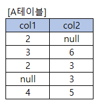

# 문제 20 — SQL 조건 검색과 COUNT

## 문제

A 테이블에서 col1이 2 또는 3이거나 col2가 3 또는 5인 행을 대상으로 count(col2)를 계산하는 SELECT의 결과값을 쓰시오.

## 원문 이미지

[원문 문제 이미지와 표 확인](https://chobopark.tistory.com/558)

<strong>정답 보기</strong>

4

<strong>상세 해설</strong>

## 핵심 개념

COUNT(*)는 행 수, COUNT(열)은 해당 열이 NULL이 아닌 행 수다.

## 풀이

WHERE의 OR는 두 조건 집합의 합집합을 고른다. COUNT(col2)는 선택된 행 가운데 col2가 NULL이 아닌 값의 개수를 센다. 원문 페이지의 결과는 4이며, 원문 표에서 조건 일치 행과 NULL 여부를 확인해 검산한다.

## 오답 분석

중복 조건을 만족하는 행은 OR에서 한 번만 결과 집합에 들어간다. COUNT(col2)는 NULL을 세지 않는다.

## 암기 포인트

COUNT(*)는 행 수, COUNT(열)은 해당 열이 NULL이 아닌 행 수다.

---
