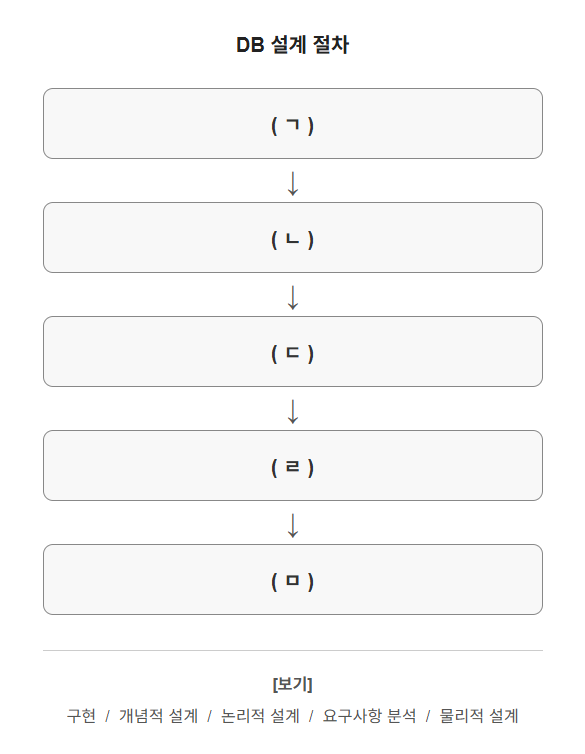

# 문제 03

## 문제

데이터베이스(DB) 설계 절차를 순서대로 나타낸 그림이다. 각 빈칸에 들어갈 알맞은 용어를 보기에서 골라 쓰시오.

보기: 구현 / 개념적 설계 / 논리적 설계 / 요구사항 분석 / 물리적 설계

<strong>정답 보기</strong>

ㄱ. 요구사항 분석
ㄴ. 개념적 설계
ㄷ. 논리적 설계
ㄹ. 물리적 설계
ㅁ. 구현

<strong>상세 해설</strong>

## 핵심 개념

데이터베이스 설계는 업무에서 필요한 데이터를 파악한 뒤, 의미 중심의 모델에서 논리 구조를 만들고 실제 저장 구조를 정해 구현하는 과정이다.

## 문제 풀이

먼저 사용자 요구를 수집·분석한다. 그다음 엔터티와 관계를 중심으로 개념 모델을 만들고, 이를 관계형 테이블 등 논리 구조로 변환한다. 인덱스와 저장 위치 같은 물리 요소를 설계한 뒤 데이터베이스를 구현한다.

## 오답 및 혼동 포인트

개념적 설계는 업무 의미를 모델링하고, 논리적 설계는 DBMS 종류와 무관한 데이터 구조를 정한다. 물리적 설계는 실제 저장·접근 방식을 정한다. 이 순서를 거꾸로 하면 요구와 구현 구조가 어긋날 수 있다.

## 암기 포인트

요구 분석 → 개념 → 논리 → 물리 → 구현 순서다.

---
