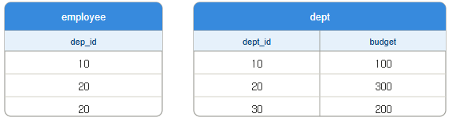

# 문제 18 — SQL 조인과 평균 예산 비교

## 문제

다음 SQL을 실행했을 때 출력되는 값을 쓰시오. 그림은 `employee`와 `dept` 테이블의 데이터다.



```sql
SELECT COUNT(*)
FROM employee e
JOIN dept d ON e.dep_id = d.dept_id
WHERE d.budget > (
    SELECT AVG(budget) FROM dept
);
```

## 정답

2

<details>
<summary><strong>상세 해설</strong></summary>

## 핵심 개념

내부 조인은 조인 키가 같은 행을 결합한다. 스칼라 하위 쿼리 `AVG(budget)`는 부서 예산의 평균을 구하고, WHERE는 그 평균보다 큰 부서에 속한 직원만 남긴다.

## 문제 풀이

부서 예산은 100, 300, 200이므로 평균은 200이다. 평균보다 큰 예산은 300인 부서뿐이다. 그 부서의 `dept_id`는 20이고 employee 테이블에 `dep_id=20`인 행이 두 개 있으므로 COUNT(*)는 2다.

## 오답 및 혼동 포인트

평균과 같은 200은 `>` 조건을 만족하지 않는다. 직원 수를 세는 것이므로 부서 행 하나가 아니라 조인 결과에서 조건을 통과한 employee 행 두 개를 센다.

## 암기 포인트

조인 후 WHERE 필터를 적용하고, 마지막에 남은 행 수를 COUNT(*)로 센다.

</details>

---

출처: [Life-Journey, 2026년 1회 정보처리기사 실기 복원 문제](https://chobopark.tistory.com/561) (원문에 CC BY 4.0 저작자표시 링크 표시)
