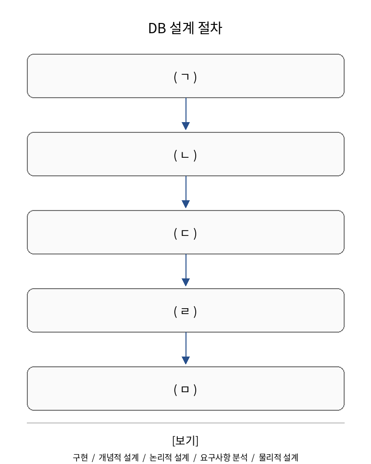

# 문제 3

## 문제

데이터베이스(DB) 설계 절차를 순서대로 나타낸 것이다. 각 빈칸에 들어갈 알맞은 용어를 쓰시오.

---

<strong>정답</strong>

ㄱ. 요구사항 분석
ㄴ. 개념적 설계
ㄷ. 논리적 설계
ㄹ. 물리적 설계
ㅁ. 구현

<strong>해설</strong>

### 핵심 개념
데이터베이스 설계는 사용자가 무엇을 원하는지 파악한 뒤, 그 요구를 데이터 모델로 만들고 실제 DB 구조로 구현하는 단계로 진행된다.

### 문제 풀이
표에 제시된 보기와 DB 설계의 표준적인 흐름을 대응시키면 다음 순서가 된다.

1. **요구사항 분석**: 어떤 데이터를 관리하고 어떤 기능이 필요한지 파악한다.
2. **개념적 설계**: 현실 세계의 요구사항을 개념적 데이터 모델로 표현한다. 대표적으로 ER 모델을 사용한다.
3. **논리적 설계**: 특정 DBMS에 종속되지 않는 논리적 구조, 예를 들어 관계형 테이블 구조로 변환한다.
4. **물리적 설계**: 실제 저장 구조, 인덱스, 저장 공간 등 물리적 구현을 고려한다.
5. **구현**: 실제 DBMS에서 테이블과 제약조건 등을 생성한다.

따라서 정답은 **요구사항 분석 → 개념적 설계 → 논리적 설계 → 물리적 설계 → 구현**이다.

### 암기 포인트
**요구 → 개념 → 논리 → 물리 → 구현** 순서로 기억한다.

