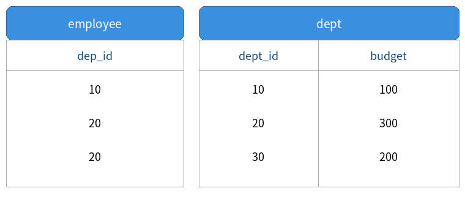

# 문제 18

## 문제

다음은 SQL에 대한 문제이다. 아래 조건과 SQL을 확인하여 출력값을 쓰시오.



```sql
SELECT COUNT(*)
FROM employee e
JOIN dept d ON e.dep_id = d.dept_id
WHERE d.budget > (
    SELECT AVG(budget) FROM dept
);
```

---

<details>
<summary><strong>정답</strong></summary>

2

</details>

<details>
<summary><strong>해설</strong></summary>

### 핵심 개념
이 문제는 `JOIN`, 서브쿼리의 `AVG()`, `WHERE` 조건, `COUNT(*)`의 순서를 이해하는 문제다.

이미지의 `dept` 테이블은 다음과 같다.

| dept_id | budget |
|---:|---:|
| 10 | 100 |
| 20 | 300 |
| 30 | 200 |

따라서 평균 예산은 `(100+300+200)/3 = 200`이다.

### 문제 풀이
서브쿼리:

```sql
SELECT AVG(budget) FROM dept
```

의 결과는 200이다.

따라서 바깥 쿼리의 조건은 `d.budget > 200`이 된다. 이 조건을 만족하는 부서는 `dept_id=20`, 예산 300인 부서 하나다.

employee 테이블에는 `dep_id`가 `10, 20, 20`인 세 행이 있으므로, JOIN 결과에서 예산 300인 부서에 속한 직원은 두 명이다.

`COUNT(*)`는 이 두 행을 세므로 결과는 **2**이다.

### 실행 흐름
`dept 평균 예산 계산 → budget > 200인 부서 선택 → employee와 JOIN → 해당 직원 행 수 COUNT → 2`

### 암기 포인트
서브쿼리의 평균은 **200**, 조건은 **200 초과**, 해당 부서의 직원 수는 **2명**이다.

</details>
