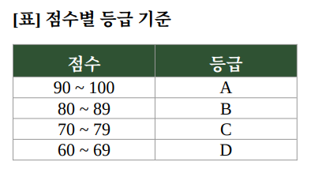

# 문제 01 — 블랙박스 테스트와 동치분할

## 문제

다음 블랙박스 테스트 기법에 대한 설명을 읽고 괄호에 들어갈 말을 보기에서 고르시오.

(ㄱ)은 프로그램 입력 조건을 유효한 값과 유효하지 않은 값의 영역으로 나누고, 각 영역을 대표하는 값을 골라 테스트 케이스를 설계하는 명세 기반 테스트 기법이다. 아래 표의 점수 구간별 대표값을 테스트할 때 적용한 기법도 쓰시오.

보기: ㄱ. 동치분할 / ㄴ. 경계값 분석 / ㄷ. 결정 테이블 테스트 / ㄹ. 상태 전이 테스트

## 정답

ㄱ. 동치분할 (Equivalence Partitioning)

<strong>상세 해설</strong>

## 핵심 개념

동치분할은 입력값을 같은 결과를 낼 것으로 기대하는 동치 클래스(유효·무효 영역)로 나누고, 각 클래스에서 대표값을 골라 테스트한다.

## 문제 풀이

첫 설명의 핵심은 입력 영역을 유효·무효 집합으로 나눈 뒤 대표값을 선택한다는 것이다. 표에서도 점수 등급별 구간을 나누고 각 구간의 값을 대표해 테스트하므로 동치분할이다.

## 오답 및 혼동 포인트

경계값 분석은 구간의 경계와 경계 바로 안팎 값을 중점적으로 확인한다. 대표값 중심이라는 설명은 경계값 분석과 구별된다. 원문 정답은 보기의 ㄱ이며, 두 빈칸 모두 같은 기법을 가리킨다.

## 암기 포인트

입력 영역을 등가인 묶음으로 나누고 대표값을 뽑으면 동치분할이다.

---

출처: [Life-Journey, 2026년 2회 정보처리기사 실기 복원 문제](https://chobopark.tistory.com/562) (원문에 CC BY 4.0 저작자표시 링크 표시)
